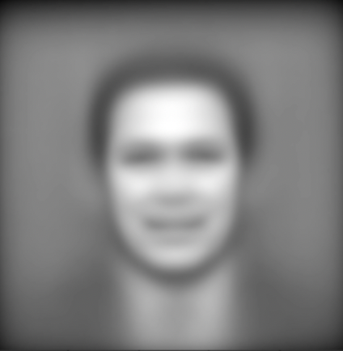

# EigenFace
Recreation of famous EigenFace Computer Vision problem.

The goal of EigenFace is to, given a set of images of people's faces, find the principal components of these images; i.e the fundamental "building blocks". In this case, we want to look for 15 of these "building blocks". With these principal components, we should be able to, ideally, reconstruct any image in the dataset to some degree. If the dataset is representative of human faces, then we should be able to construct "new" faces to some degree of realism.

## How to Use

Currently updating the structure and implementation of this project -- will update this soon! (9/8/2024)

## How it Works

We can start out with a dataset of images, I used the one provided by [scikit-learn](https://scikit-learn.org/stable/auto_examples/applications/plot_face_recognition.html). These images are 250x250 pixels and colored. This implies that they exist in 250x250x3 space. We can reduce dimensionality by making these images black and white, reducing it to 250x250, producing the follow example image:

250x250 is still pretty big, so we can use an average-pooling technique to down sample. What this means is that we take small nxn non-overlapping grids in our image and take the average among each grid to produce 1 pixel each. In this case, I used 5x5 grids, producing a 50x50 pixel image:

We can now apply this process to all of our images as our cleaning procedure. The neat thing we can do now is observe the "average" face by taking the mean over all of these 50x50 matrices:

Now, in order to obtain our principal components, we need to be able to perform [Singular Value Decomposition (SVD)](https://en.wikipedia.org/wiki/Singular_value_decomposition#SVD_and_spectral_decomposition) on this dataset. We can do this by reshaping each image into an N-dimensional vector (N=2500 in our case) and group them into a 2500xM data matrix Z where M is the number of images/observations we have. 

We can decompose $Z$ into $U$, $\sigma$, and $V$. We can obtain our principal components from U and sort by the amount of variance that they explain. We can then take the first $k$ of these principal components to get our best "building blocks". Certain linear combinations of these images should produce, ideally, any image within our dataset. Here is the 15th principal component:

